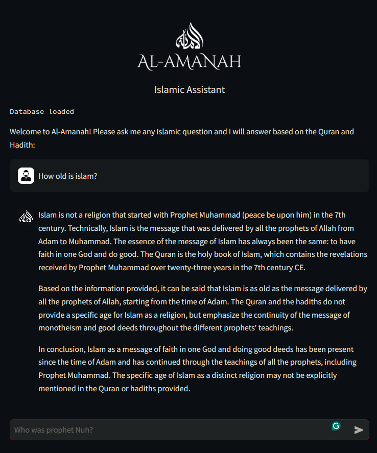

# Al-Amanah: An Islamic RAG Chatbot

Al-Amanah is an AI-powered chatbot that provides answers to questions about Islam, based on the Quran and Hadith. It leverages Retrieval-Augmented Generation (RAG) techniques to generate contextually accurate answers, using both the translated Quran and two Hadith collections as its knowledge base. Built using Streamlit, the chatbot offers an intuitive interface and maintains chat history to improve the flow and coherence of each conversation.

## Features

- **Islamic Knowledge Base**: Provides answers based on the Quran and two Hadith collections.
- **Contextual Awareness**: Retains chat history for each user session to maintain conversational flow.
- **User-Friendly Interface**: Built with Streamlit for a clean and accessible UI.
- **IP Tracking**: Logs user IP addresses for session tracking.
- **Session History**: Logs and stores each conversation’s questions and answers for reference.

## Key components include:

- **IP Tracking**: Tracks user IP using WebSocket headers for each session.
- **Resource Caching**: Quran and Hadith vector stores are loaded and cached to optimize performance.
- **Session Management**: Maintains chat history in st.session_state to retain context within conversations.

## Future Enhancements

- **Additional Knowledge Sources**: Include more Islamic resources to expand the chatbot's knowledge base.
- **Multilingual Support**: Provide support for multiple languages, especially Arabic.
- **Advanced Analytics**: Improve logging and analysis for user interactions.
